# Secrets guide

> **Spoiler warning.** This guide gives away every secret in the campaign: where each hidden hero
> waits, every hidden area and every secret exit, step by step with pictures. If you want to find
> them yourself, stop reading here. If you are stuck, jump straight to the entry you need from the
> table of contents and skip the rest.

Everything here is about the **campaign** (a save file played from the world map). Hidden heroes,
the story's partners and most of these hidden areas only exist there. Every screenshot was taken
from the game itself.

This is the second edition, for 0.4.18, the release that adds Sophia III (the first, for 0.4.13, had every hidden hero but
Sophia III).

## How secrets work

- **Hidden heroes.** You start with Mario only. Eight heroes from other games are hidden in the
  levels, brainwashed by Bowser's stolen wand. Walk up to one and **TALK** (press up next to them)
  to start a short mini game themed on that hero's own game. Win it and the hero is free: you can
  pick them from then on. Lose and you can try again, or walk away and come back later. Every hero
  you have talked to also gets their mini game in the **Mini Game Arena** (see
  [The Warp Zone hub](#the-warp-zone-hub-and-the-mini-game-arena)).
- **The map hints.** Clear a level that still hides a hero and a faint shadow of that hero appears
  beside its node on the world map. Stand on the node and Toad drops a hint on the bottom line.
  Toad's greeting in 1-0 also tells you where heroes like to hide: pipes, vines and hidden blocks.

  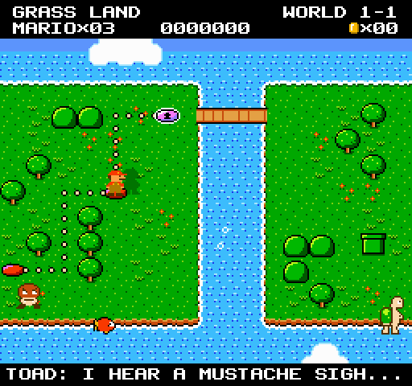

- **Partners.** From World 2 on, someone from each hidden hero's own game stands near the start of
  that hero's level (or in a bonus room close by). **TALK** to them (or **READ**, for the statue)
  for a hint about where the hero is. You can read them again any time.
- **Secret exits.** A level with a second way out has a pink dot on the map. Each exit opens its
  own road: the secret exit opens the secret road only, and the level still counts as cleared only
  when you finish it the normal way.
- **Every hero can do every secret.** Each route in this guide has been played through with all
  nine heroes, small and big. Where a hero needs a different trick, the entry says so.

## Contents

- [World 1](#world-1)
  - [Luigi: the 1-1 bonus room](#luigi-the-1-1-bonus-room)
  - [The 1-2 warp spot](#the-1-2-warp-spot)
  - [The Warp Zone hub and the Mini Game Arena](#the-warp-zone-hub-and-the-mini-game-arena)
- [World 2](#world-2)
  - [Partner: the old man (2-1)](#partner-the-old-man-2-1)
  - [Link: the sky ruins above 2-1](#link-the-sky-ruins-above-2-1)
  - [The Top Secret Area (2-1)](#the-top-secret-area-2-1)
- [World 3](#world-3)
  - [Partner: Dr. Light (3-1)](#partner-dr-light-3-1)
  - [Mega Man: the space station above 3-1](#mega-man-the-space-station-above-3-1)
- [World 4](#world-4)
  - [Partner: the bird statue (4-1)](#partner-the-bird-statue-4-1)
  - [Samus: the cavern under 4-2](#samus-the-cavern-under-4-2)
  - [Larry Koopa's airship (4-2)](#larry-koopas-airship-4-2)
  - [The bonus road and the Hammer Bro](#the-bonus-road-and-the-hammer-bro)
- [World 5](#world-5)
  - [Partner: the townsperson (5-4)](#partner-the-townsperson-5-4)
  - [Simon: the crypt under 5-4](#simon-the-crypt-under-5-4)
- [World 6](#world-6)
  - [Partner: Irene (6-2)](#partner-irene-6-2)
  - [Ryu: the dojo behind 6-2](#ryu-the-dojo-behind-6-2)
- [World 7](#world-7)
  - [Partner: Lance (7-3)](#partner-lance-7-3)
  - [Bill: the jungle camp under 7-3](#bill-the-jungle-camp-under-7-3)
- [World 8](#world-8)
  - [Partner: Jason (8-4)](#partner-jason-8-4)
  - [Sophia III: the garage under 8-4](#sophia-iii-the-garage-under-8-4)
  - [The road to the Lost Levels](#the-road-to-the-lost-levels)
- [Secret exits on the map](#secret-exits-on-the-map)
- [Lost Levels warp zones](#lost-levels-warp-zones)

## World 1

### Luigi: the 1-1 bonus room

|              |                                                                       |
| ------------ | --------------------------------------------------------------------- |
| **What**     | Hidden hero: Luigi                                                    |
| **Where**    | World 1-1, the bonus room under the fourth pipe                       |
| **Who can**  | Every hero. Ryu can also cling to the wall and climb up to the ledge. |
| **Map hint** | "I HEAR A MUSTACHE SIGH..."                                           |

1. In 1-1, stand on the fourth pipe (the tallest one, after the three smaller pipes) and press
   **DOWN** to go in.

   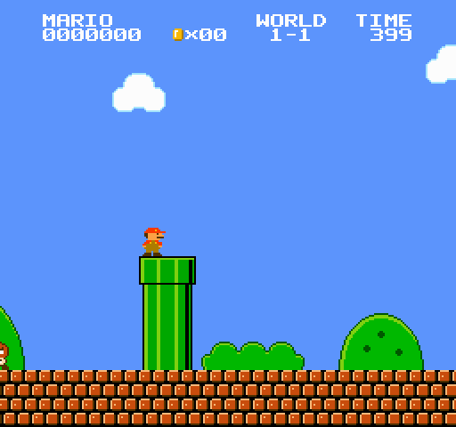

2. The bonus room has a small ledge of blocks high in the top-right corner, and Luigi is standing
   on it. Climb onto the block of coin bricks in the middle and take a running **JUMP** to the
   right, up onto the ledge.

   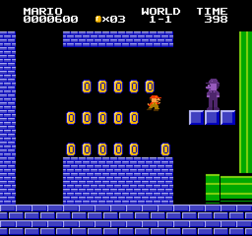

3. Stand next to Luigi and **TALK**.

   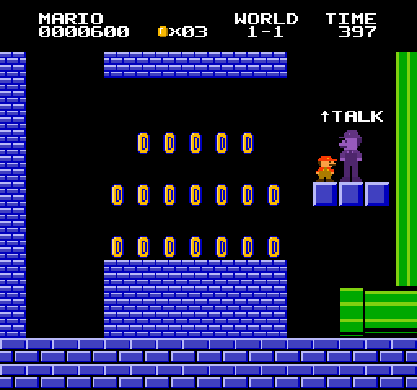

The pipe at the right takes you back to 1-1, near the end of the level.

### The 1-2 warp spot

|             |                                                                   |
| ----------- | ----------------------------------------------------------------- |
| **What**    | Secret exit of 1-2: a road to World 1's warp spot (the Warp Zone) |
| **Where**   | World 1-2, on top of the ceiling at the end of the level          |
| **Who can** | Every hero                                                        |

1. Near the end of 1-2, ride the lifts up and **JUMP** onto the top of the ceiling.
2. **RUN** right along the top of the ceiling, past the exit pipe.

   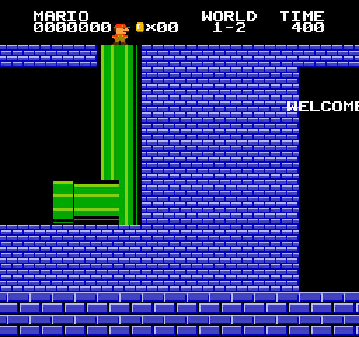

3. Drop down into the room at the end. In the campaign the warp zone has only one pipe and no
   numbers. Go down it.

   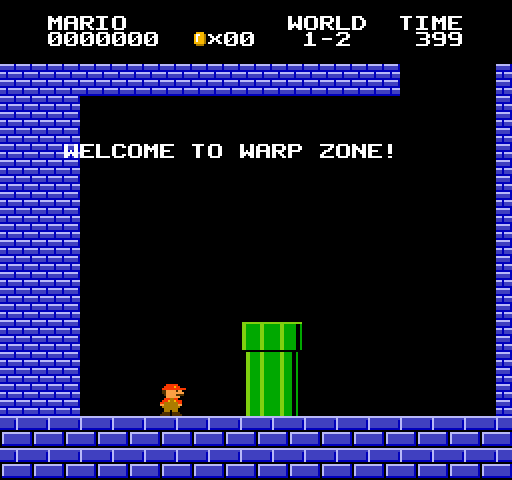

4. You are back on the World 1 map, and a new road leads from 1-2 to the **warp spot**. 1-2 is
   not cleared by this: finish it at its flagpole to open the road to 1-3.

   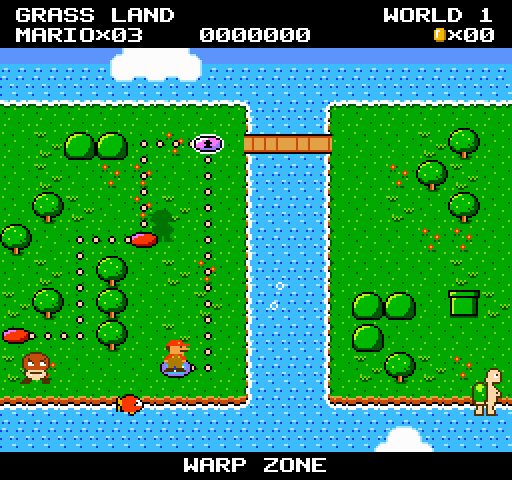

### The Warp Zone hub and the Mini Game Arena

|             |                                                                             |
| ----------- | --------------------------------------------------------------------------- |
| **What**    | Hidden map page: the Warp Zone hub (Starlight Crossing)                     |
| **Where**   | World 1's warp spot (found through [the 1-2 warp spot](#the-1-2-warp-spot)) |
| **Who can** | Every hero                                                                  |

1. Walk to the warp spot on the World 1 map and **JUMP** on it.
2. You arrive in the middle of the Warp Zone hub. Its pads:
   - **Middle:** RETURN TO WORLD 1.
   - **East:** the **Mini Game Arena**, where you can replay the mini game of every hero you have
     talked to, just for fun.
   - **North, south and west:** "??? - A FUTURE SECRET". These are locked in this version.

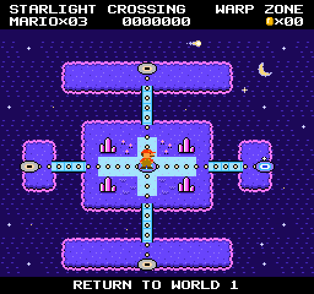

## World 2

### Partner: the old man (2-1)

At the very start of 2-1, an old man waits in a cave doorway between two fires. Stand next to him
and **TALK**. He gives you a coin, then tells you how to find Link.

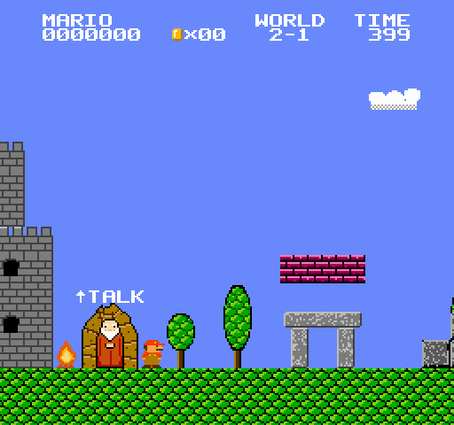

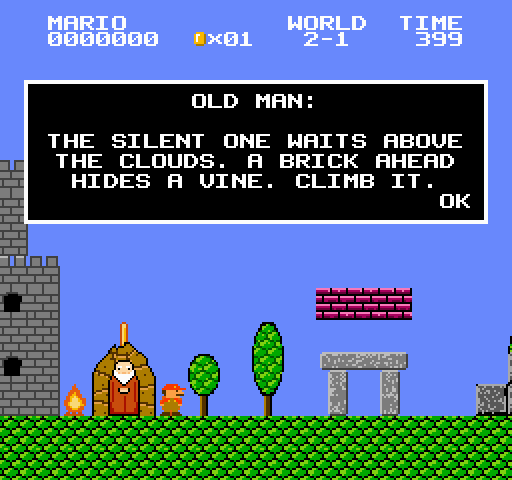

### Link: the sky ruins above 2-1

|              |                                                     |
| ------------ | --------------------------------------------------- |
| **What**     | Hidden hero: Link                                   |
| **Where**    | World 2-1, above the coin heaven, in the sky palace |
| **Who can**  | Every hero                                          |
| **Map hint** | "SOMETHING UP THERE HUMS..."                        |

1. In 2-1, a row of five bricks floats high above two groups of ? blocks. Its middle brick hides
   a vine: **JUMP** from the ? blocks to the left of it, drifting right, to bump it, then climb the
   vine (**UP**) to the coin heaven.

   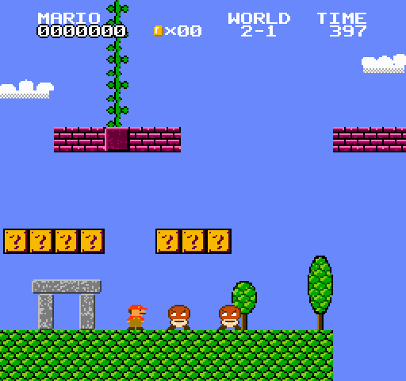

2. Cross the coin heaven to where the clouds end. Hop over to the small cloud platforms past the
   end. Over the middle one, the coins run out: **JUMP** straight up there to bump a hidden
   block. A second vine grows out of it. Climb it.

   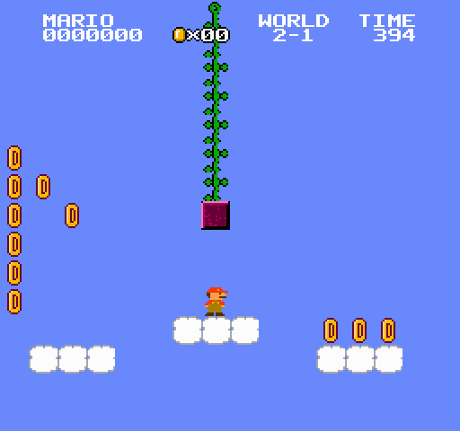

3. You arrive in Link's sky palace on the clouds. Hop across the floating palace blocks to the
   great gate, go into the hall and **JUMP** over the gap in its floor. Link stands on the altar
   in the middle of the hall, under the gold crest: climb its steps and **TALK** to him.

   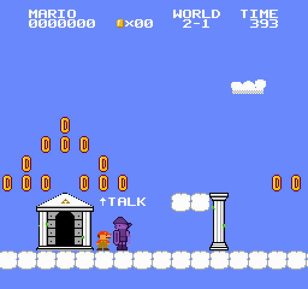

Walk on through the hall and out onto the balcony, then drop off its edge to land back in 2-1.
A fall anywhere in the palace lands you back in 2-1 too.

### The Top Secret Area (2-1)

|             |                                                                                   |
| ----------- | --------------------------------------------------------------------------------- |
| **What**    | Secret exit of 2-1 (the Moblin's cave) and a hidden map node: the Top Secret Area |
| **Where**   | World 2-1, the last tower before the flagpole                                     |
| **Who can** | Every hero. Simon uses an extra cloud ledge to get up (see step 2).               |

**The way in: over the flagpole.** If you get past 2-1's flagpole **without touching it**, you can
walk on past the castle into a cave. A hidden block lays a path of clouds that lets every hero
jump clear over the pole.

1. Before the last tall tower, stand on the bricks next to it and **JUMP** straight up: you bump
   a hidden coin block. It is the usual way up the tower.

   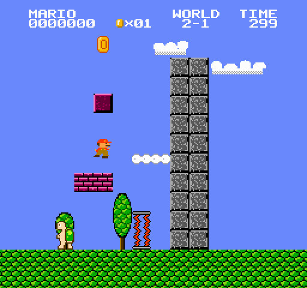

2. Stand on top of that coin block. Walk back off its **left** edge and **JUMP** up and to the
   left. You bump a second hidden block, high up. A path of clouds appears, one cloud at a time,
   running from the top of the tower toward the flagpole (and two cloud steps appear lower down so
   you can climb back up if you fell).

   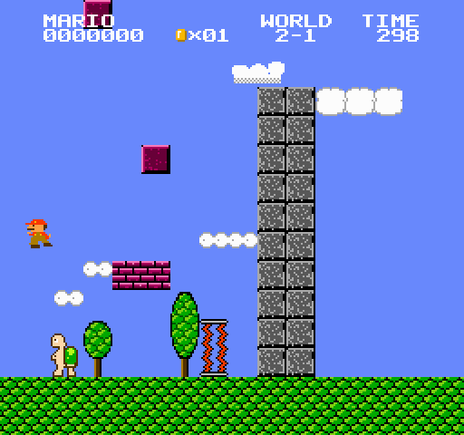

   **Simon:** his jump is fixed once he leaves the ground, so a one-way cloud ledge against the
   tower, just above the bricks, is his way up. Hop onto it from the bricks (or land on it coming
   down from the springboard), then jump from it onto the coin block.

   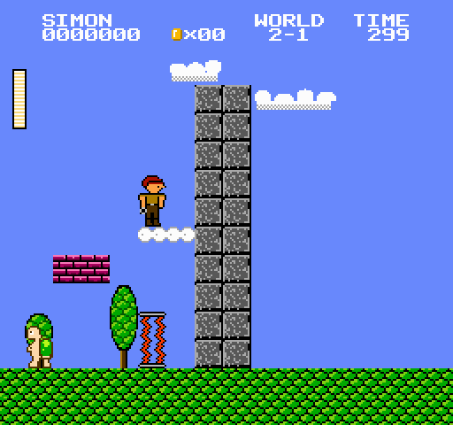

3. Get on top of the tower (the springboard at its foot helps), wait for the path to finish, then
   **RUN** along the clouds and **JUMP** off the far end. You sail over the top of the pole.

   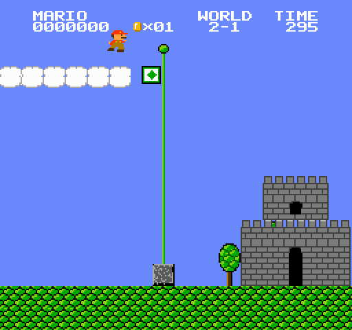

4. Keep going right, past the castle. At the end of the level there is a rocky cave mouth. Walk
   into it.

   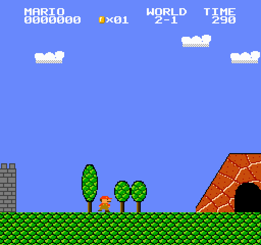

If you touch the pole, the level just ends the normal way. Try again on your next visit.

**The Moblin's cave.**

5. Inside, a friendly Moblin sits between two fires. Walk up to him: he is surprised you found
   him, and tells you a secret.

   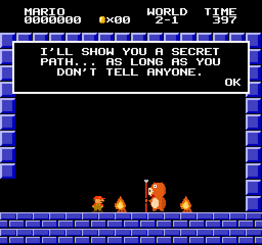

6. Back on the World 2 map, this one exit opens **both** roads out of 2-1: the normal one to 2-2
   and a new one to a hidden node, the **TOP SECRET AREA**.

   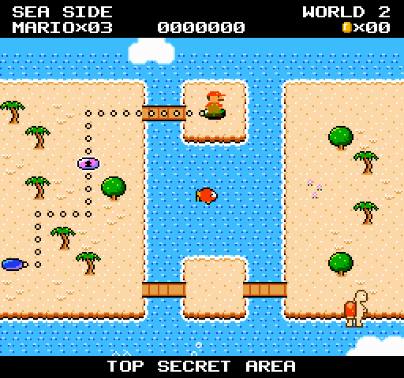

**The Top Secret Area.** **JUMP** on its node to go in, any time. It is a small screen with five ?
blocks: two fire flowers, a Yoshi egg in the middle (it hatches a 1-up) and two mushrooms. There
is no clock. The blocks are full again on every visit. The pipe takes you back to the map.

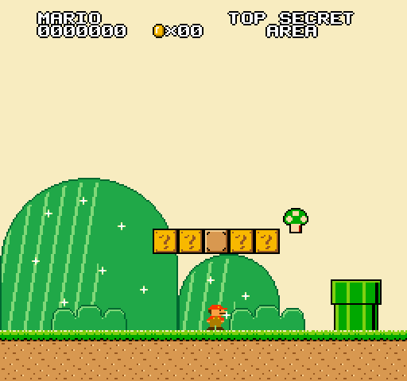

## World 3

### Partner: Dr. Light (3-1)

Dr. Light waits in 3-1's bonus room, under the first pipe you can go down. **TALK** to him for a
hint about Mega Man.

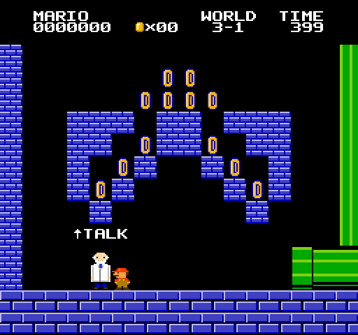

### Mega Man: the space station above 3-1

|              |                                                     |
| ------------ | --------------------------------------------------- |
| **What**     | Hidden hero: Mega Man                               |
| **Where**    | World 3-1, a hidden teleporter past the coin heaven |
| **Who can**  | Every hero                                          |
| **Map hint** | "A STAR UP THERE BLINKS..."                         |

1. Late in 3-1, the last brick in a short row high up hides a vine. **JUMP** from the bricks under
   it to bump it, and climb the vine to the coin heaven.
2. Cross the coin heaven to its end. A trail of coins hops over two small cloud platforms. Stand
   on the second (wider) one and **JUMP** where the coins point straight up: you bump a hidden
   teleporter block, and a teleport pad rises out of the cloud two tiles to its right.

   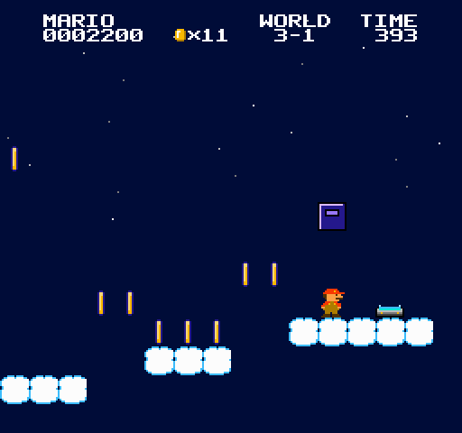

3. Stand on the pad. It beams you up to a space station.

   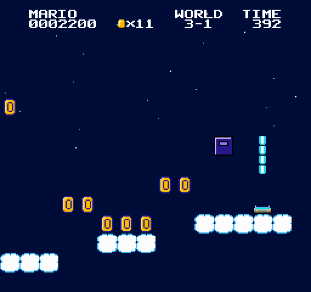

4. Walk right along the station's deck. Mega Man stands under the big window. **TALK** to him.

   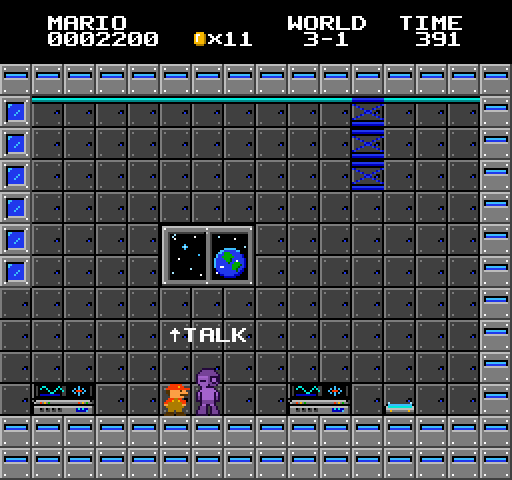

The pad just past Mega Man (and the one you arrived on, once you step off it) beams you back down
into 3-1. The clock keeps running the whole time.

## World 4

### Partner: the bird statue (4-1)

In 4-1's bonus room (down the pipe about two thirds of the way through the level) stands an old
bird statue with glowing eyes. Stand next to it and **READ** the words cut into its base.

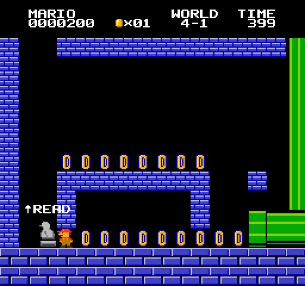

### Samus: the cavern under 4-2

|              |                                                 |
| ------------ | ----------------------------------------------- |
| **What**     | Hidden hero: Samus                              |
| **Where**    | World 4-2, the warp zone at the top of the vine |
| **Who can**  | Every hero                                      |
| **Map hint** | "THE PIPES HERE ECHO..."                        |

1. Early in 4-2, a brick high up hides a vine. Hidden blocks under it make a staircase: bump them
   from below, climb them and bump the brick. Climb the vine.
2. At the top is a warp zone. In the campaign it shows just one pipe, with no number: it no longer
   warps. Go down it.

   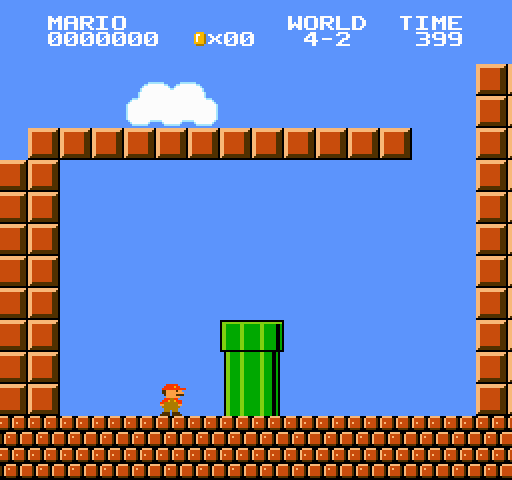

3. You drop into a blue rock cavern. Go right through the doors and the low tunnel.

   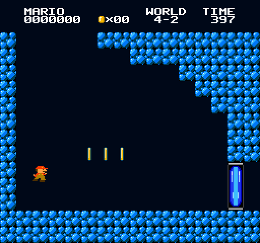

4. In the statue's chamber, Samus waits on the dais beside the bird statue. **TALK** to her.

   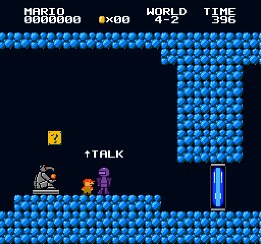

Past her, another door and a pipe bring you back up into 4-2, just past the vine. The clock keeps
running.

### Larry Koopa's airship (4-2)

|             |                                                                                                   |
| ----------- | ------------------------------------------------------------------------------------------------- |
| **What**    | Hidden area and secret exit of 4-2: Larry Koopa's airship, his crystal ball and the road it opens |
| **Where**   | World 4-2, the warp zone at the end of the level                                                  |
| **Who can** | Every hero (every hero's main attack hurts Larry)                                                 |

1. Near the end of 4-2, ride the lifts up and **JUMP** onto the top of the ceiling. **RUN** right
   along it, past the exit pipe, and drop into the room at the end. It looks like a warp zone, but
   its pipe does not work.
2. As soon as you land, an anchor crashes down through the ceiling and smashes the pipe. Its chain
   rises off the top of the screen.

   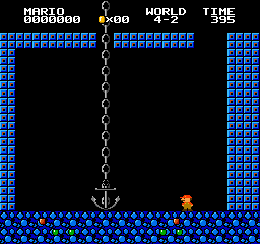

3. Climb the chain (**UP**).

   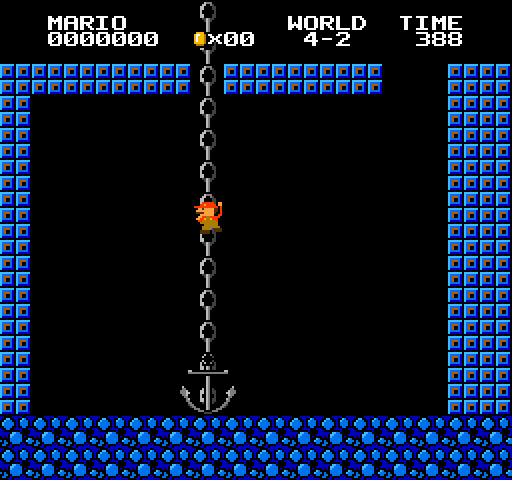

4. You come out on the bow of Larry's airship. The screen scrolls by itself: keep moving, dodge
   the cannonballs and the Rocky Wrenches popping out of the deck, and reach the pipe at the stern.
   Go down it.

   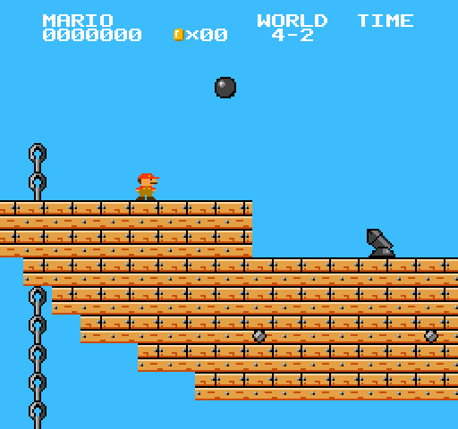

5. Larry is waiting in his cabin. He hops at you and fires rings from his wand. **Stomp** him three
   times (after a stomp he spins in his shell, and touching the shell hurts), or hit him six
   times with fireballs or your hero's attacks.

   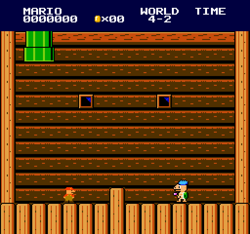

6. Beaten, he drops his **crystal ball**. Touch it.

   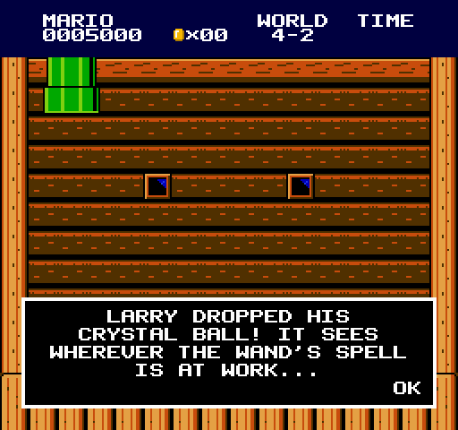

Dying on the airship never costs a life: **TRY AGAIN?** starts the deck (or the cabin, once you
have reached it) over. Choosing NO takes you back to 4-2.

**What the crystal ball does:**

- Back on the map, Larry's airship crashes on World 4 and Toad turns the wreck into a **bonus
  spot**, with a road from 4-2 ([next entry](#the-bonus-road-and-the-hammer-bro)). This is 4-2's
  secret exit: 4-2 itself is not cleared by it.
- From now on the map shows the shadow of **every** hero you have not freed yet, beside their
  level, even before you clear that level.
- Your file gets an **item inventory**: prizes from the bonus spot are kept, and you can use them on
  the map before a level.

After Larry is beaten, the warp zone room in 4-2 is sealed for good.

### The bonus road and the Hammer Bro

|             |                                                                 |
| ----------- | --------------------------------------------------------------- |
| **What**    | Hidden map node: World 4's bonus spot, with its Hammer Bro      |
| **Where**   | World 4 map, the road from 4-2 (opened by Larry's crystal ball) |
| **Who can** | Every hero                                                      |

1. Walk from 4-2 to the bonus spot and **JUMP** on it. The bottom line says which game is next.

   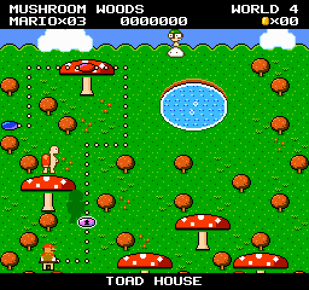

2. It plays one of three bonus games, in turn:
   - **Toad House:** pick one of three chests (a mushroom, a fire flower or a star).
   - **N-Spade:** a memory game; turn the cards over in pairs.
   - **Spade game:** stop three reels to line up a picture.

   Prizes go into your item inventory.

   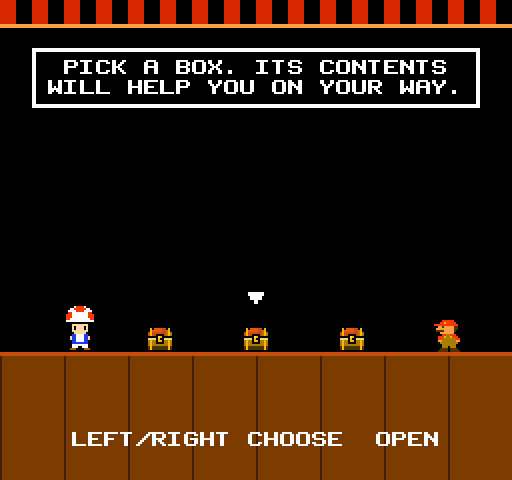

3. Once you have played, the spot is closed. After you enter your next level, a **Hammer Bro**
   comes out and wanders on the road to the bonus spot.

   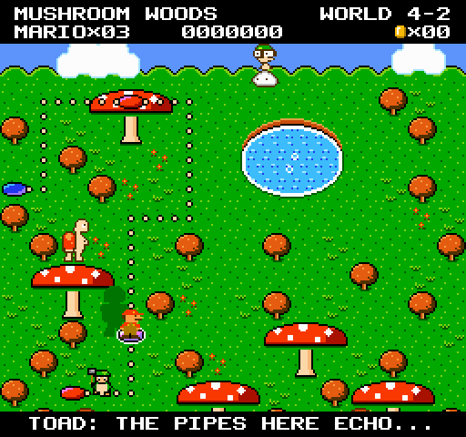

4. Walk into him to fight: two Hammer Bros on one screen. Beat them both and you win an item, and
   the bonus spot opens again. If you lose, you lose a life and he stays on the road.

   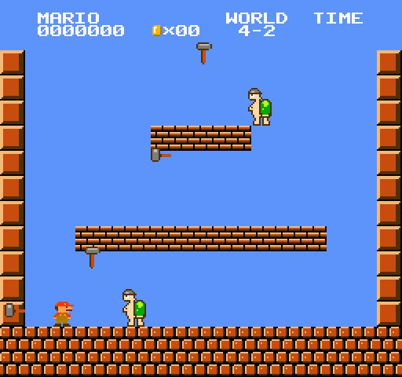

## World 5

### Partner: the townsperson (5-4)

A townsperson in a hooded cloak stands right at the start of 5-4. **TALK** to them for a (slightly
unreliable) hint about Simon.

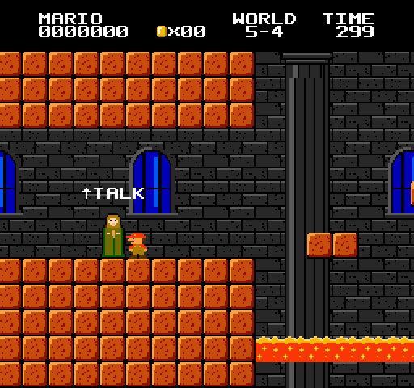

### Simon: the crypt under 5-4

|              |                                                                                 |
| ------------ | ------------------------------------------------------------------------------- |
| **What**     | Hidden hero: Simon                                                              |
| **Where**    | World 5-4, under the lift shaft                                                 |
| **Who can**  | Every hero. Small Mario and small Luigi have no attack: they use a Koopa shell. |
| **Map hint** | "THIS LIFT SMELLS OF BATS"                                                      |

1. In 5-4, find the shaft with the lifts. Get on a lift going **down** (the down lifts have a faint
   skull on their middle plank) and stay on it. Ride it on past the bottom of the shaft. Falling into the
   shaft without the lift is still deadly, so ride it down.

   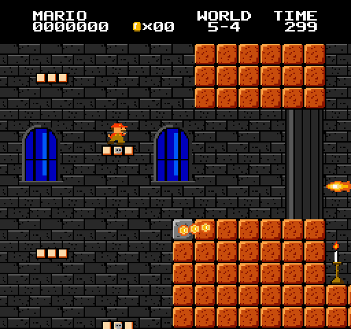

2. The lift carries you down into a dungeon room. At the left end is a **cracked wall**, and a
   Koopa paces in front of it.

   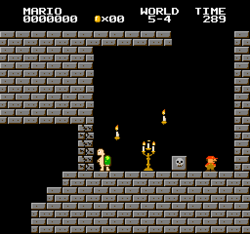

3. Break the wall: **ATTACK** it, shoot it, bump it with your head as big Mario, or kick a Koopa
   shell into it. One hit opens the whole doorway. (Small Mario and small Luigi: stomp the Koopa
   and kick its shell into the wall. If you lose the Koopa, another walks back in.)

   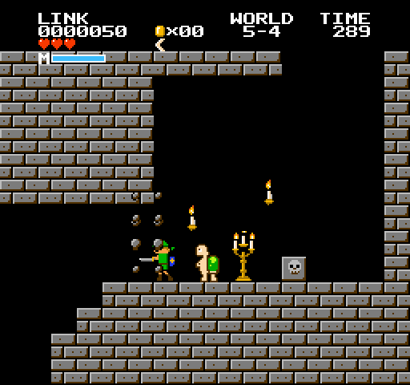

4. Go down the steps behind the wall and drop through the hole into the crypt. Simon kneels under
   the stained glass. **TALK** to him.

   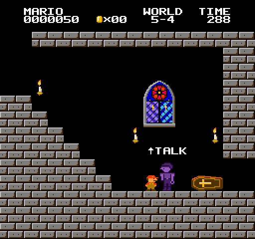

The dark doorway in the crypt's right wall brings you back into 5-4, past the lift section. Snuff
the candles in both rooms for coins.

## World 6

### Partner: Irene (6-2)

Agent Irene stands at the start of 6-2. **TALK** to her for a hint about Ryu.

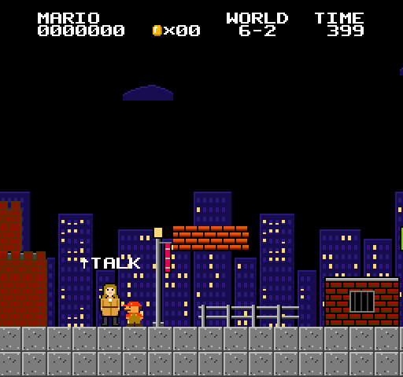

### Ryu: the dojo behind 6-2

|              |                                                            |
| ------------ | ---------------------------------------------------------- |
| **What**     | Hidden hero: Ryu                                           |
| **Where**    | World 6-2, the bonus room under the first pipe             |
| **Who can**  | Every hero (Samus can roll into the wall in her ball, too) |
| **Map hint** | "A WALL IN HERE IS WATCHING"                               |

1. Go down the first pipe in 6-2.

   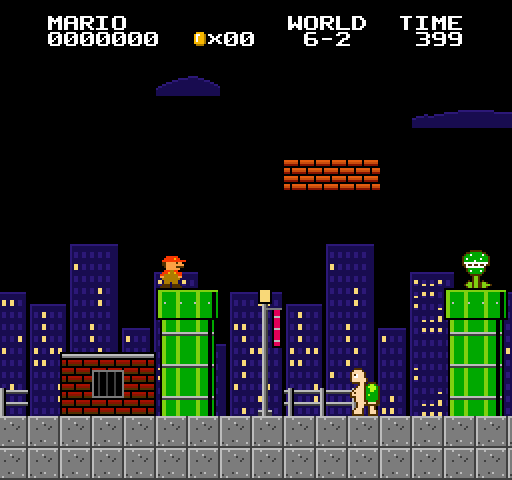

2. In the bonus room, a cracked tile with a throwing star stuck in it marks the **left** wall, and
   an arrow of coins points at it.

   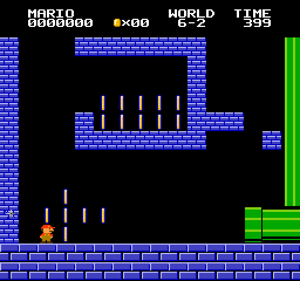

3. Walk into that wall and keep pushing for about a second. The panel spins and flips you through
   to the other side. A short push does nothing.

   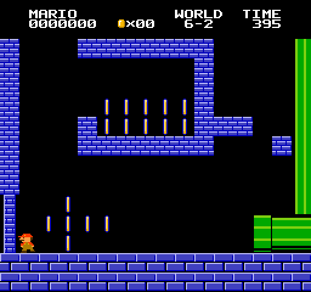

4. You are in a ninja's dojo under a moonlit window. Ryu stands at the left. **TALK** to him.

   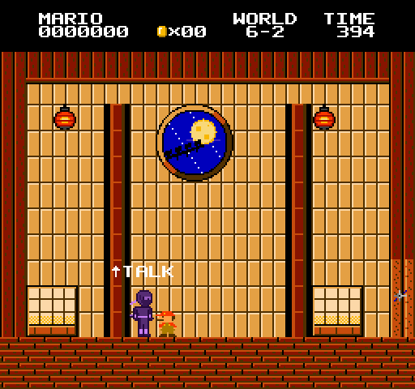

To leave, push into the panel in the dojo's right wall: it flips you out into 6-2, up the next
pipe. The trick wall only works one way.

## World 7

### Partner: Lance (7-3)

Lance stands at the start of 7-3. **TALK** to him for a hint about Bill.

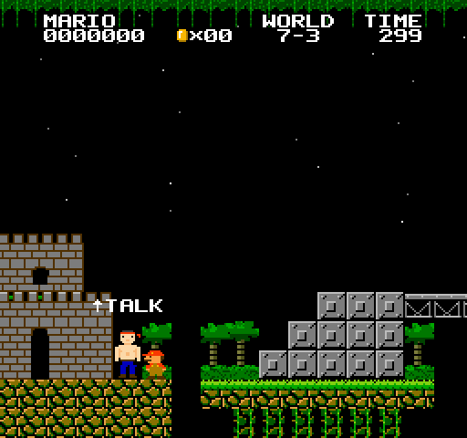

### Bill: the jungle camp under 7-3

|              |                                                           |
| ------------ | --------------------------------------------------------- |
| **What**     | Hidden hero: Bill                                         |
| **Where**    | World 7-3, under the exploding bridge past the checkpoint |
| **Who can**  | Every hero                                                |
| **Map hint** | "I SMELL A CAMPFIRE..."                                   |

1. Just past 7-3's checkpoint, one bridge is marked: a red light blinks on its post and an arrow of
   coins points down at it. Step onto it and it starts blowing up behind you, piece by piece.
2. **Stand still** (or walk) and let it go: you fall through the gap. (If you keep running you
   just outrun the explosions; you can still jump into the gap on purpose afterwards. Any other
   fall in 7-3 is deadly.)

   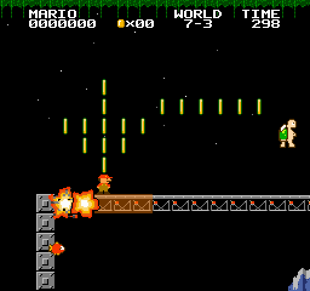

3. You drop into Bill's jungle camp.

   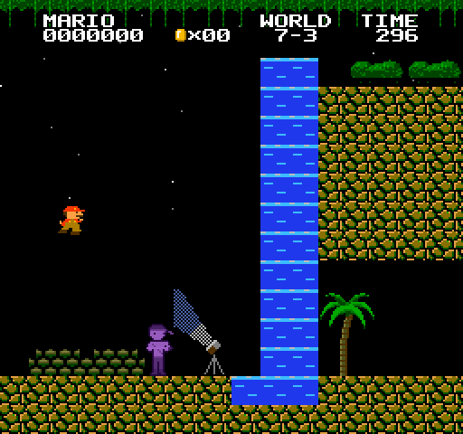

4. Bill stands by the sandbags under the searchlight. **TALK** to him.

   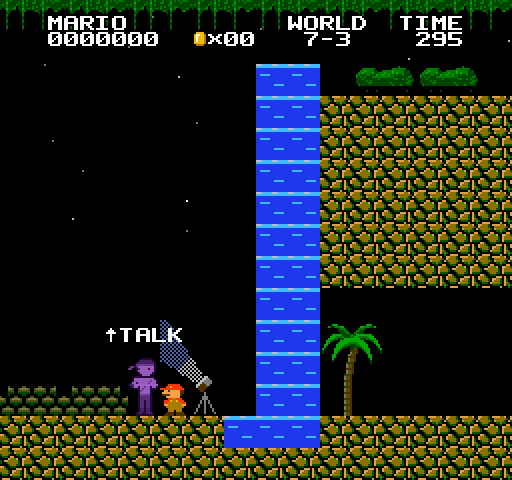

**The way back: the waterfall climb.** Hop out of the shallow river and walk into the cave mouth
under the cliff on the right. Climb the rock ledges beside the waterfall up to a vine on the right
wall, climb it, then take the ledges left to the vine on the left wall. Climb it off the top of the
screen: you come out on the tree platform past the bridge in 7-3.

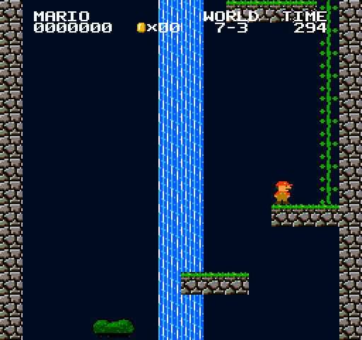

## World 8

### Partner: Jason (8-4)

Jason, Sophia III's pilot, is not at the start of 8-4: he is lost in a hidden cave behind its trap
pipe (below). **TALK** to him there: he is looking for his frog, Fred.

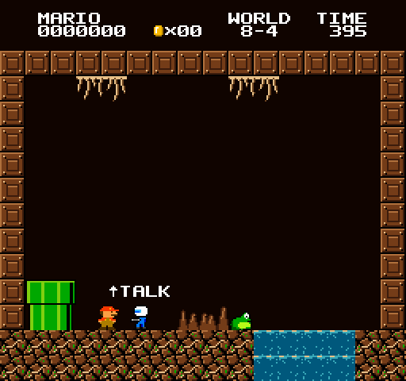

### Sophia III: the garage under 8-4

|              |                                                                        |
| ------------ | ---------------------------------------------------------------------- |
| **What**     | Hidden hero: Sophia III (the tank)                                     |
| **Where**    | World 8-4, down the trap pipe just after the water section             |
| **Who can**  | Every hero. Simon walks along the floor of the flooded tunnel instead. |
| **Map hint** | "A FROG CROAKED IN THERE"                                              |

1. Get through 8-4 to its water section and swim to its pipe: you come up a pipe into the last
   stretch of the castle. The **next pipe**, a few steps to the right, is the one everybody skips:
   outside the campaign it only sends you back into the castle maze. Stand on it and go down it.

   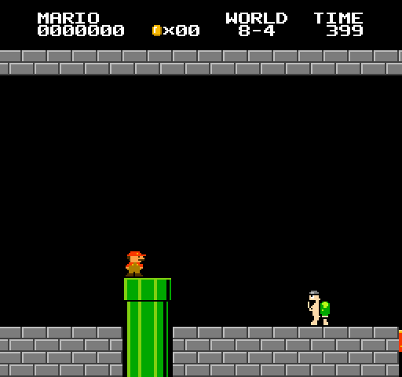

2. In the campaign it leads to a hidden cave instead, where Jason is calling for Fred, who sits on
   the edge of a pool. **TALK** to Jason (or just walk up to Fred): Fred hops into the pool and
   dives out of sight.

   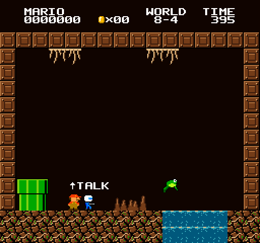

3. Jump into the pool after him. You drop into a flooded tunnel: **SWIM** right, following Fred,
   to the pipe on the floor at the far end, and walk into it.

   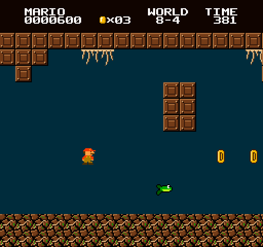

4. The pipe leads up into Sophia III's garage. The tank waits under the gateway. **TALK** to her.

   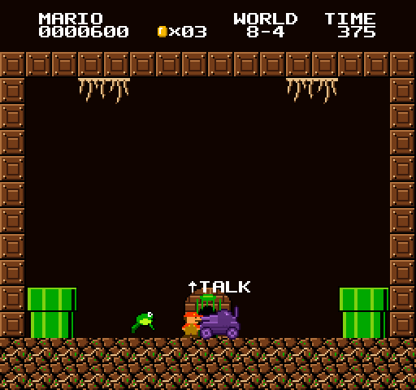

**The way back.** The pipe at the right of the garage brings you back up out of the trap pipe in
8-4, and the level goes on from there as before (the detour is a secret, not a shortcut). The
clock keeps running all the way, so keep an eye on it.

### The road to the Lost Levels

|             |                                                                   |
| ----------- | ----------------------------------------------------------------- |
| **What**    | The road on from World 8 to the Lost Levels (the story continues) |
| **Where**   | World 8 map, after beating 8-4                                    |
| **Who can** | Every hero                                                        |

After 8-4 and the credits, you are back on the World 8 map, and a road draws in off the right edge
from Bowser's castle to **Lost World 1**. The Lost Levels' worlds then open one after another as
you beat each castle, up to World D. (The Warp Zone hub no longer has a Lost Levels pad: its east
pad is the Mini Game Arena now.)

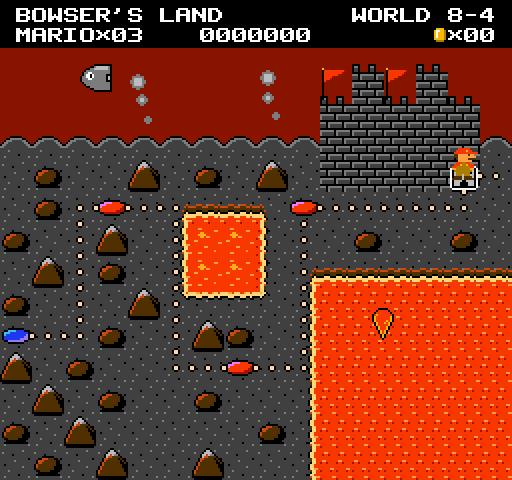

## Secret exits on the map

A level node with a pink dot has a second way out. In World 1 to 8 there are three:

| Level | Secret exit                                                     | Opens                                                      |
| ----- | --------------------------------------------------------------- | ---------------------------------------------------------- |
| 1-2   | The warp zone's pipe ([entry](#the-1-2-warp-spot))              | The road to World 1's warp spot and the Warp Zone hub      |
| 2-1   | The Moblin's cave ([entry](#the-top-secret-area-2-1))           | The road to the Top Secret Area, and 2-1's normal road too |
| 4-2   | Larry Koopa's crystal ball ([entry](#larry-koopas-airship-4-2)) | The road to World 4's bonus spot                           |

The Lost Levels' pink dots are their warp zones (next section).

## Lost Levels warp zones

The Lost Levels keep the original game's warp zones, backward ones included. Taking one opens the
world it leads to and moves you there on the map; it clears nothing. Worlds A to D are numbered 10
to 13 in a warp zone.

| Level    | How to get there                                                                | Leads to |
| -------- | ------------------------------------------------------------------------------- | -------- |
| Lost 1-2 | Run along the top of the ceiling past the exit pipe, on to the end of the level | World 2  |
| Lost 1-2 | Climb the vine from the brick early in the level                                | World 3  |
| Lost 1-2 | Drop off the end of the ceiling run and go down the pipe in the floor there     | World 4  |
| Lost 3-1 | Jump over the flagpole and keep going right                                     | World 1  |
| Lost 3-1 | Go down the first pipe into the bonus room and take its way out                 | World 1  |
| Lost 5-1 | Jump over the flagpole and keep going right                                     | World 6  |
| Lost 5-2 | Run along the top of the ceiling past the exit pipe                             | World 7  |
| Lost 5-2 | Climb the vine                                                                  | World 8  |
| Lost 8-1 | Go down the pipe near the end into the underwater area and take its exit pipe   | World 5  |
| Lost A-2 | Run along the top of the ceiling past the exit pipe                             | World B  |
| Lost A-3 | Jump over the flagpole (use the springboard) and keep going right               | World C  |
| Lost B-4 | The fourth pipe in the castle                                                   | World D  |

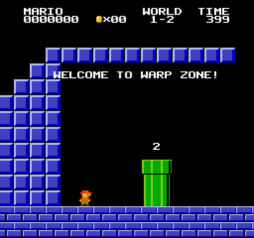
